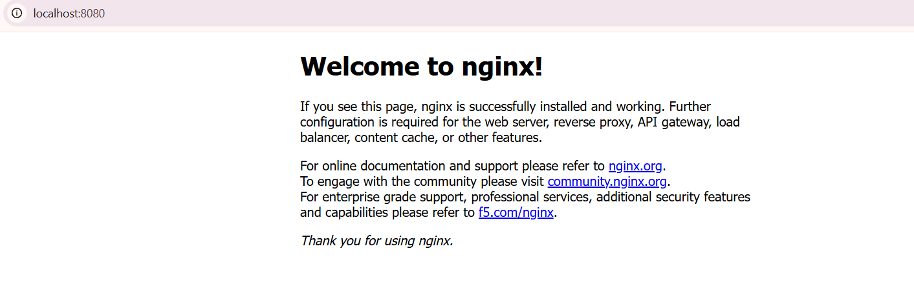

# Lab 01: Deploy & Expose Nginx Pod on Kubernetes (Minikube)

## Objective
Deploy an Nginx web server container as a Kubernetes Pod using Minikube on Windows 11, expose it using a `NodePort` Service, access it through HTTP, and record evidence of successful deployment.

---

## Environment Setup
* **OS:** Windows 11 Home Single Language
* **Container Runtime:** Docker Desktop
* **Minikube Version:** `v1.38.1`
* **Kubernetes Version:** `v1.35.1`
* **CLI Tools:** `kubectl`, `minikube`

---

## Step-by-Step Execution

### 1. Verify Minikube Cluster Health
```powershell
minikube status
kubectl get nodes
kubectl get pods -A
```
* **Status:** Host, kubelet, apiserver, and kubeconfig fully running. Node `minikube` in `Ready` status.

### 2. Deploy Nginx Pod
```powershell
kubectl run hello-k8s --image=nginx --port=80
kubectl get pods
```
* **Status:** Pod `hello-k8s` showing `1/1 Running`.

### 3. Expose Pod via NodePort Service
```powershell
kubectl expose pod hello-k8s --type=NodePort --port=80
kubectl get services
```
* **Status:** Service `hello-k8s` created with type `NodePort`.

### 4. Access Nginx Web Interface
```powershell
kubectl port-forward service/hello-k8s 8080:80
# Or using minikube service tunnel:
# minikube service hello-k8s --url
```
* **URL:** `http://localhost:8080` (Displays "Welcome to nginx!").

---

## Deployment Evidence



---

## Verification Summary
- **Pod Status:** `hello-k8s` (`1/1 Running`)
- **Service Status:** `hello-k8s` (`NodePort`)
- **HTTP Access:** Nginx Welcome Page accessible at `http://localhost:8080`
